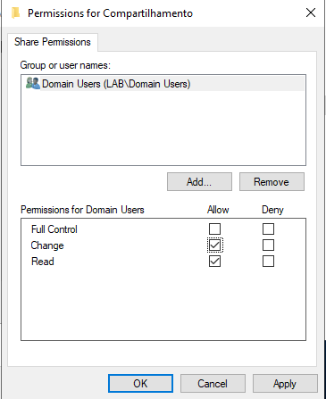

# 🖥️ Active Directory Lab — Infraestrutura de Rede

Projeto de laboratório simulando um ambiente corporativo com Active Directory e serviços de infraestrutura de rede no Windows Server.

---

# 🎯 Objetivo

Simular um ambiente real de TI com foco em:

- Active Directory (AD DS)
- DHCP Server
- File Server (SMB)
- Group Policy (GPO)
- Suporte técnico (N1/N2)

---

# 🧩 Tecnologias Utilizadas

- Windows Server  
- Active Directory Domain Services (AD DS)  
- DHCP Server  
- File Server (SMB)  
- Group Policy Management (GPMC)  
- VMware Workstation  
- Windows Client  

---

COMANDOS UTILIZADOS:

## 📡 DHCP

- ipconfig
- ipconfig /release
- ipconfig /renew
- ipconfig /all

---

## FILE SERVER

- ping <ip-do-servidor>
- Acesso ao compartilhamento de rede via Explorer (Win + R)
  \\servidor\compartilhamento
  
---

## GPO

- gpupdate /force
- gpresult /r

---

# 📡 CHAMADO 01 — DHCP (Cliente sem IP)

## ⚙️ Pré-configuração do servidor

Instalação do serviço DHCP no Windows Server.

---

Configuração inicial do serviço DHCP no servidor.

---

## 🟨 Criação do escopo

Criação do escopo DHCP responsável pela distribuição de IPs na rede.

---

## 🟥 Problema
Cliente sem endereço IP válido na rede.

---

## 🔍 Diagnóstico
Verificação do funcionamento do DHCP após criação do escopo.

---

## 🟩 Solução
Correção da configuração do escopo DHCP e liberação de IP automático ao cliente.

---

## 🌐 Resultado
Conectividade com a internet restabelecida com sucesso.

---

# 📁 CHAMADO 02 — FILE SERVER (Acesso negado)

## 🟥 Problema
Usuário não conseguia acessar a pasta compartilhada.

---

## 🔍 Diagnóstico
Permissões incorretas identificadas no compartilhamento.

---

## 🟩 Solução
Correção das permissões da pasta compartilhada.

---

## 📸 Complemento
Validação do acesso pelo cliente.

---

## 📸 Resultado final
Acesso liberado com sucesso.

---

# 🔐 CHAMADO 03 — GPO (Bloqueio do Painel de Controle)

## 🟦 Situação inicial
Usuário com restrição de acesso ao Painel de Controle.

---

## 🟥 Problema
Política de grupo aplicada bloqueando o acesso ao Painel de Controle.

---

## 🔍 Diagnóstico
Verificação da GPO aplicada no domínio.

---

## 🟩 Solução
Correção da GPO e atualização das políticas no cliente.

---

## 📸 Resultado
Acesso ao sistema restaurado após ajuste da política.

---

# 🧠 Competências Desenvolvidas

- Active Directory Administration  
- DHCP Server Configuration  
- File Server Management  
- Group Policy (GPO)  
- Troubleshooting de rede  
- Suporte técnico em Windows Server  

---

# 🏁 Conclusão

Projeto simula ambiente corporativo real de infraestrutura de TI com administração de servidores e resolução de incidentes.

---

# 🚀 Resultado Final

✔ Active Directory funcional  
✔ DHCP configurado corretamente  
✔ File Server operacional  
✔ GPO aplicada com sucesso  
✔ Projeto pronto para portfólio de estágio em TI  
