# Projeto de Infraestrutura de Rede — Continuação do Active Directory

Este projeto é a **continuação de um ambiente de Active Directory previamente criado**, onde foi implementado um domínio base (`lab.local`) com usuários e estrutura inicial.

Nesta etapa, o ambiente foi expandido com serviços essenciais de infraestrutura de rede, simulando um cenário real de empresa e atividades de suporte técnico.

---

#  Objetivo

Expandir a infraestrutura de Active Directory adicionando serviços de rede e simulação de suporte técnico, incluindo:

- DHCP (Distribuição automática de IP)
- File Server (Compartilhamento de arquivos)
- Group Policy Object (GPO)

---

#  Tecnologias Utilizadas

- Windows Server
- Active Directory (AD DS)
- DHCP Server
- File Server (SMB)
- Group Policy Management (GPO)
- VMware Workstation
- Windows Client

---

#  CHAMADO 01 — DHCP (Cliente sem IP)

## Situação
Cliente não estava recebendo endereço IP automático e não conseguia acessar a rede.

---

##  Diagnóstico
- Identificado IP inválido no cliente
- Verificado escopo DHCP no servidor
- Confirmado serviço DHCP ativo

---

##  Evidências

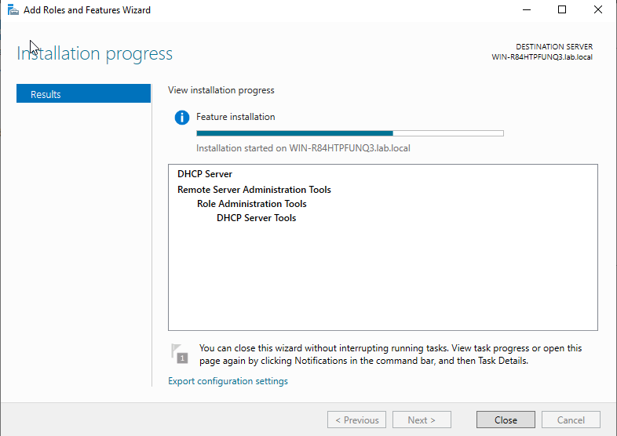  
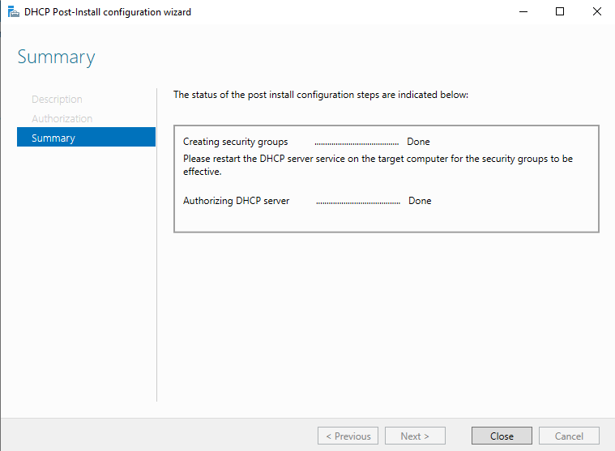  
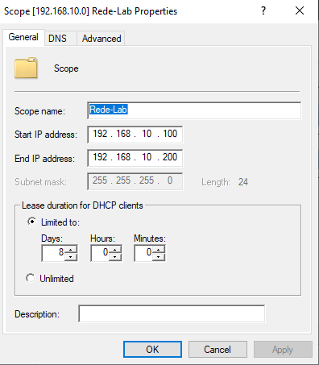  
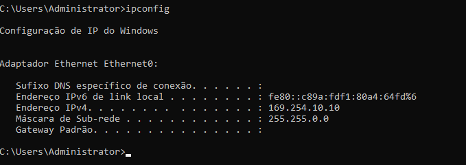  
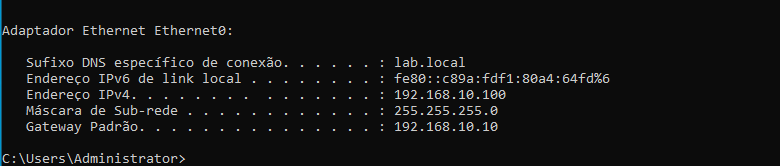  
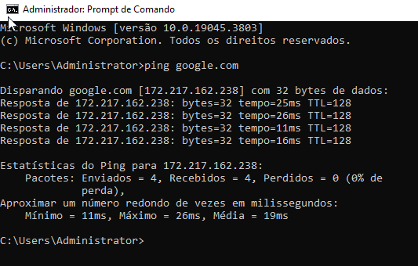

---

##  Resultado final
Cliente passou a receber IP automaticamente e acessar a rede normalmente.

---

#  CHAMADO 02 — FILE SERVER (Acesso negado)

##  Situação
Usuário não conseguia acessar a pasta compartilhada no servidor.

---

##  Diagnóstico
- Verificado acesso via rede
- Identificado erro de permissão
- Ajuste necessário em permissões NTFS e compartilhamento

---

## Evidências

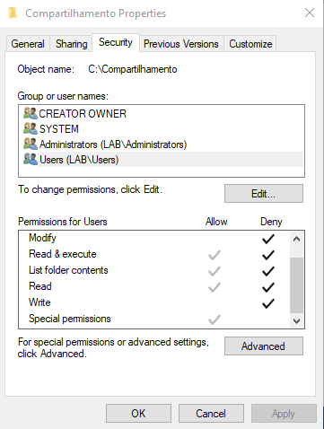  
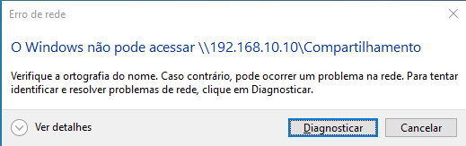  
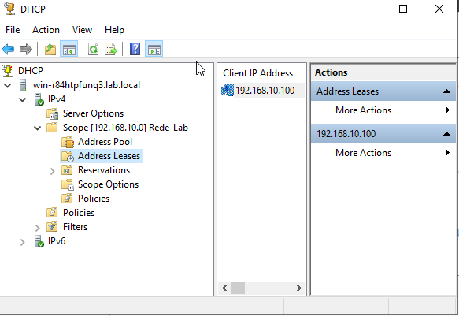  
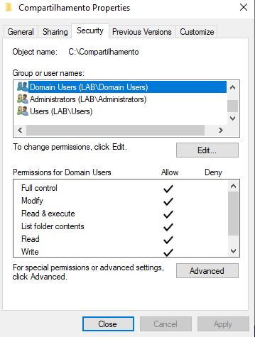  
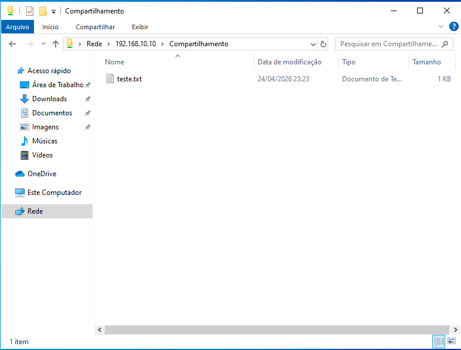

---

##  Resultado final
Usuário conseguiu acessar e utilizar a pasta compartilhada normalmente.

---

#  CHAMADO 03 — GPO (Bloqueio Painel de Controle)

##  Situação
Usuário não conseguia acessar o Painel de Controle devido a política aplicada no domínio.

---

##  Diagnóstico
- Verificado usuário no domínio
- Confirmado aplicação de GPO
- Identificada política de bloqueio ativa

---

## Evidências

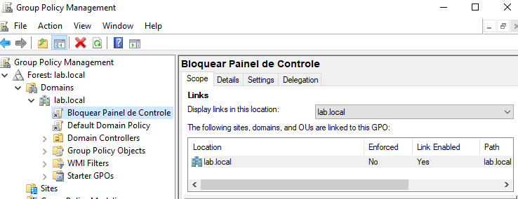  
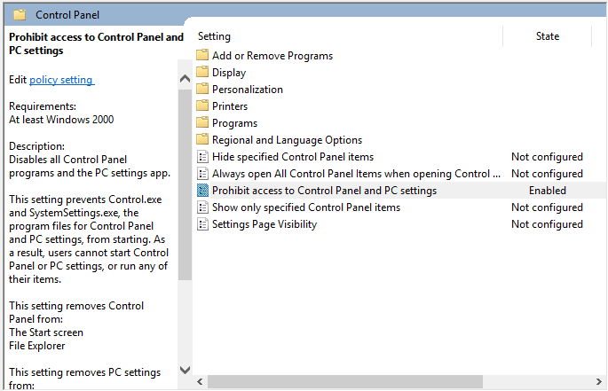  
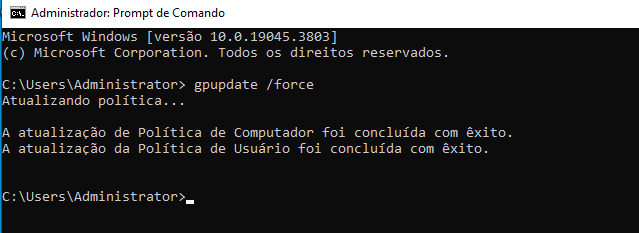  
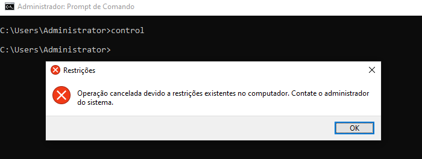  
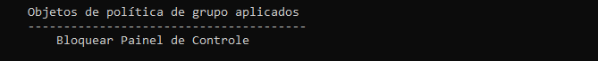

---

##  Solução
- Acessado Group Policy Management (GPMC)
- Localizada GPO responsável pelo bloqueio
- Alterado estado da política de **Enabled → Not Configured**
- Aplicada atualização no cliente com `gpupdate /force`

---

##  Evidências da correção

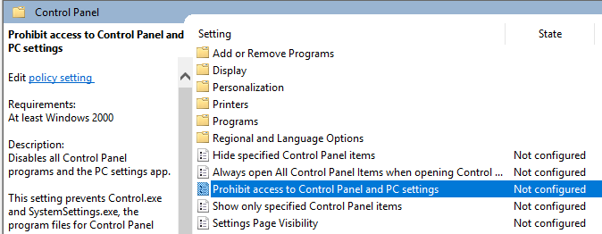  
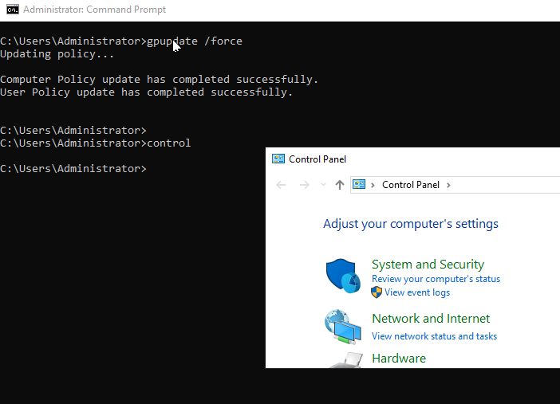

---

##  Resultado final
Após atualização da política de grupo, o acesso ao Painel de Controle foi restabelecido com sucesso.

---

#  Conclusão

Este projeto representa a **evolução de um ambiente de Active Directory**, expandido com serviços essenciais de infraestrutura corporativa.

Foram simulados cenários reais de suporte técnico e administração de sistemas, incluindo:

- Configuração de rede corporativa
- Distribuição de IP com DHCP
- Gerenciamento de permissões em File Server
- Aplicação de políticas de segurança com GPO
- Diagnóstico e resolução de problemas de infraestrutura

---

#  Resultado Final

✔ Ambiente de Active Directory funcional e expandido  
✔ Serviços de rede corporativa implementados  
✔ Simulação de suporte técnico N1/N2  
✔ Projeto completo para portfólio de estágio em TI  

---
